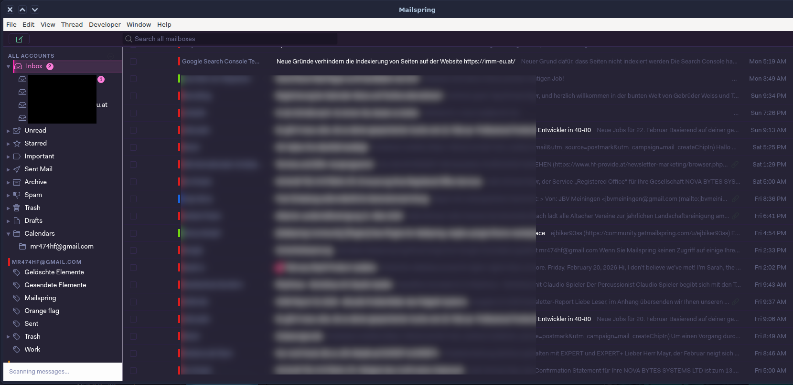

# SynthWave '84 — Mailspring Theme

Ein Dark-Mode-Theme für den [Mailspring](https://getmailspring.com/) E-Mail-Client, inspiriert vom populären [SynthWave '84](https://marketplace.visualstudio.com/items?itemName=RobbOwen.synthwave-vscode) VS Code Theme.



---

## Aussehen

Das Theme taucht die gesamte Mailspring-Oberfläche in die charakteristische Neon-Ästhetik der 80er Synthwave-Ära:

- **Hintergrund** — Tiefes, dunkles Lila (`#262335`) als Basis, leicht helleres Lila (`#241b2f`) für Sidebar und Header
- **Sidebar** — Dunkle Ordnerstruktur mit **Neon-Pink-Akzenten** auf dem aktiven Ordner und einem leuchtenden Glow-Effekt
- **E-Mail-Liste** — Dunkler Hintergrund, ungelesene Mails heben sich mit **Neon-Mint** ab
- **Auswahl & Hover** — Aktive Elemente leuchten mit einem subtilen Pink-Glow und einem `3px`-Neon-Border links
- **Badges** — Ungelesene-Zähler in sattem Neon-Pink
- **Scrollbars** — Dezent, werden beim Hover zu leuchtendem Pink
- **Statusfarben** — Erfolg (Mint), Warnung (Gelb), Fehler (Orange), Info (Cyan)

---

## Farbpalette

| Element | Farbe | Hex |
|---|---|---|
| Hintergrund (Main) | Deep Dark Purple | `#262335` |
| Hintergrund (Sidebar/Header) | Dark Purple | `#241b2f` |
| Hintergrund (Inputs) | Darkest Purple | `#1a1525` |
| Akzent — Neon Pink | Hot Pink | `#ff7edb` |
| Akzent — Neon Pink (bright) | Bright Pink | `#f92aad` |
| Akzent — Neon Mint | Cyan/Mint | `#72f1b8` |
| Akzent — Neon Yellow | Soft Yellow | `#fede5d` |
| Akzent — Neon Orange | Coral | `#f97e72` |
| Akzent — Neon Blue | Electric Cyan | `#36f9f6` |
| Text (Primary) | Off-White | `#ffffff` |
| Text (Subtle) | Blueish Grey | `#848bb2` |
| Text (Very Subtle) | Muted Purple | `#6a6a8e` |
| Border | Purple | `#34294f` |

---

## Voraussetzungen

- [Mailspring](https://getmailspring.com/) **>= 1.9.0**

---

## Installation

### 1. Repository klonen

```bash
git clone https://github.com/<dein-username>/mail-spring-theme-synthwave-84.git
```

### 2. Theme-Ordner kopieren

Je nach Installation von Mailspring in das passende Verzeichnis kopieren:

| Installation | Pfad |
|---|---|
| Linux (Standard) | `~/.config/Mailspring/packages/` |
| Linux (Flatpak) | `~/.var/app/com.getmailspring.Mailspring/config/Mailspring/packages/` |
| macOS | `~/Library/Application Support/Mailspring/packages/` |
| Windows | `%APPDATA%\Mailspring\packages\` |

**Beispiel für Linux (Standard):**
```bash
cp -r mail-spring-theme-synthwave-84 ~/.config/Mailspring/packages/synthwave-84
```

**Beispiel für Linux (Flatpak):**
```bash
cp -r mail-spring-theme-synthwave-84 \
  ~/.var/app/com.getmailspring.Mailspring/config/Mailspring/packages/synthwave-84
```

### 3. Theme aktivieren

Mailspring öffnen → **Edit** → **Change Theme…** → **SynthWave '84** auswählen.

---

## Anpassung

Die gesamte Farbpalette ist in `styles/_palette.less` zentral definiert. Dort lassen sich alle Farben in einer einzigen Datei anpassen:

```less
// Akzentfarbe ändern:
@neon-pink: #ff7edb;

// Hintergrund aufhellen:
@bg-dark: #2e2a45;
```

---

## Projektstruktur

```
mail-spring-theme-synthwave-84/
├── package.json
├── assets/                      # Neon-SVG-Icons (als CSS-Masken)
│   ├── neon-pen.svg
│   ├── neon-inbox.svg
│   ├── neon-sent.svg
│   ├── neon-drafts.svg
│   ├── neon-trash.svg
│   ├── neon-archive.svg
│   ├── neon-spam.svg
│   └── neon-star.svg
└── styles/
    ├── index.less               # Entry Point
    ├── ui-variables.less        # Mailspring Variable Overrides
    ├── _palette.less            # Farbpalette (hier anpassen)
    └── components/
        ├── _base.less
        ├── _toolbar.less
        ├── _accounts.less
        ├── _threadlist.less
        ├── _messages.less
        ├── _composer.less
        ├── _search.less
        ├── _scrollbars.less
        ├── _notifications.less
        ├── _preferences.less
        └── _misc.less
```

---

## Lizenz

MIT — siehe [LICENSE](LICENSE)
